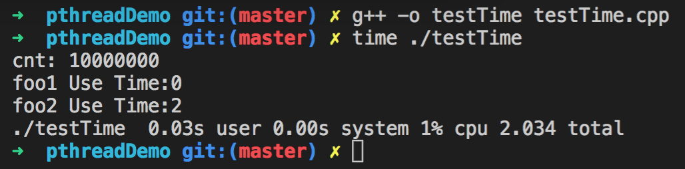
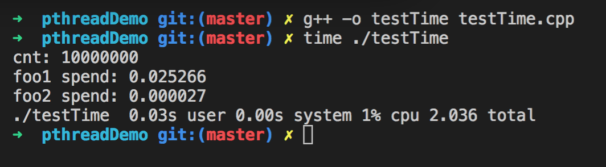
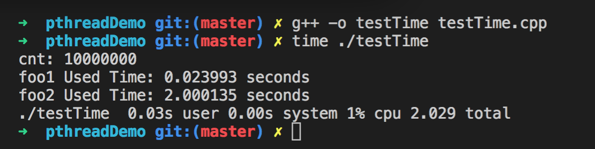

# Linux下函数执行时间统计及分析总结

## 一. 测试某个函数的执行时间
&emsp;&emsp;统计函数或某一段代码的运行时间在软件开发中常常遇到。透过运行时间可分析出函数或程序段的运行效率和性能，从而有针对性的对代码进行优化。比如获得相机sdk取一张图片消耗的时间，以确定sdk的取流能力。目前网络上存在这大量的这类测试时间的函数，但是有些函数的精度低，有些更是测试的时间不正确。为此，本人在将统计函数执行时间的方法进行对比分析，并进行总结，重点比较其适用范围及精确度。

&emsp;&emsp;本文将测试的两个函数如下：
```c++
// 函数1: 变量自增，cpu密集型
void foo1()
{
    long cnt = 0;
    for(long i=0; i<1000000000; ++i)
    {
        cnt += 1;
    }
    printf("cnt: %ld\n", cnt);
}
```

```c++
// 函数2: 定时函数sleep，不消耗cpu，采用中断机制，头文件 <unistd.h>
void foo2()
{
    sleep(2);
}
```

### 1.测试方法1, time()法
time()获取当前的系统时间，返回的结果是一个time_t类型，其实就是一个大整数，其值表示从CUT（Coordinated Universal Time）时间1970年1月1日00:00:00（称为UNIX系统的Epoch时间）到当前时刻的秒数.

```c++
void test1()
{
    time_t start,stop;
    start = time(NULL);
    foo1();           // 执行foo1消耗的时间
    stop = time(NULL);
    printf("foo1 Use Time:%ld\n",(stop-start));

    start = time(NULL);
    foo2();           // 执行foo1消耗的时间
    stop = time(NULL);
    printf("foo2 Use Time:%ld\n",(stop-start));
}
```
执行结果如下：


从图中可以看出，该方法统计foo1的时间为0，统计foo2的时间为2s，利用Linux的shell函数，可以的到整个程序消耗了2.034s。
- 优点：能统计sleep的时间
- 缺点：精度差，只能精确到秒

### 2.测试方法2, clock()法

```c++
void test2()
{
    clock_t start, end;
    double seconds;

    start = clock();  // 记录起始时间
    foo1();           // 执行foo1消耗的时间
    end = clock();    // 记录结束时间
    seconds  =(double)(end - start)/CLOCKS_PER_SEC;     
    printf("foo1 spend: %f\n sencods", seconds);
    
    start = clock();  // 记录起始时间
    foo2();           // 执行foo2消耗的时间
    end = clock();    // 记录结束时间
    seconds  =(double)(end - start)/CLOCKS_PER_SEC;
    printf("foo2 spend: %f\n sencods", seconds);
}
```
执行结果如下：


&emsp;&emsp;从图中可以看出，该方法统计foo1的时间为0.025266s，统计foo2的时间为0.000027s，为什么函数foo2明明上sleep了2s，测试的结果时间接近0呢？

&emsp;&emsp;因为sleep把进程的运行状态改为睡眠，将其从系统可执行队列去掉，这样系统就不会调度到该进程，不会分配CPU时间片。而clock()返回从“开启这个程序进程”到“程序中调用clock()函数”时之间的CPU时钟计时单元（clock tick）数。这样clock函数就统计不到sleep的时间。

- 优点：统计的精度高，精确到us
- 缺点：不能统计slepp, usleep的时间，会导致统计的程序用时错误。

### 3.测试方法3, gettimeofday()法
```c++
void test3()
{
    struct timeval tpstart, tpend;
    float timeuse;
 
    gettimeofday(&tpstart, NULL);
    foo1();
    gettimeofday(&tpend, NULL);
    timeuse = CLOCKS_PER_SEC * (tpend.tv_sec - tpstart.tv_sec) + tpend.tv_usec - tpstart.tv_usec;
    timeuse /= 1000;
    printf("foo1 Used Time: %f seconds\n", timeuse);

    gettimeofday(&tpstart, NULL);
    foo2();
    gettimeofday(&tpend, NULL);
    timeuse = CLOCKS_PER_SEC * (tpend.tv_sec - tpstart.tv_sec) + tpend.tv_usec - tpstart.tv_usec;
    timeuse /= 1000;
    printf("foo2 Used Time: %f seconds\n", timeuse);
}
```

执行结果如下：


&emsp;&emsp;从图中可以看出，该方法统计foo1的时间为0.023993，统计foo2的时间为2.000135s，可以看到foo2可以对sleep进行测试，且误差可以精确到us级别，测试foo2函数出来的误差为0.1ms，准确度高。

- 优点：统计的精度高，精确到us。且能统计sleep睡眠的时间。
- 缺点：该函数不常见，难记忆，需要单独记录。

### 总结
**综上所述：我们在进行Linux测试某个函数或某段代码时，尽量选用测试方法三，gettimeofday()法，以获得高精度和准确型的程序执行时间。**

----

## 二. 寻找运用程序的性能瓶颈

&emsp;&emsp;我们除了会关心某段已知的代码消耗的时间外，常常下面的情况，维护的旧代码或者是新完成的应用程序在性能上存在问题时，需要对程序进行性能方面的分析，找到程序中是哪些函数消耗掉了大部分执行时间，确定应用程序的时间性能瓶颈，对程序进行优化，以达到性能的要求。

&emsp;&emsp;针对上面的问题，我们不能对每个函数打印时间，必须借助工具进行分析。

### 1. gprof 工具简介
&emsp;&emsp;Gprof是GNU gnu binutils工具之一，linux系统一般都带有这个工具。gprof可以可以显示程序运行的“flat profile”，包括每个函数的调用次数，每个函数消耗的处理器时间。也可以显示“调用图”，包括函数的调用关系，每个函数调用花费了多少时间。还可以显示“注释的源代码”，是程序源代码的一个复本，标记有程序中每行代码的执行次数。有了函数的调用关系，这会让开发人员大大提高工作效率，不用费心地去一点点找出程序的运行流程，这对小程序来说可能效果不是很明显，但对于有几万，几十万代码量的工程来说，效率是毋庸置疑的！

将用到的测试的函数如下：
```c++
// test1, test2, test3分别对应上面的函数
int main(int argc, char *argv[])
{
    test1();
    test2();
    test3(); 
    return 0;
}
```
### 1.gprof的使用方法
- 步骤一：在编译和链接时，加上编译选项 -pg ,如果要得到带注释的源码清单，则需要增加 -g 选项。一般在Makefile中增加
```sh
g++ -pg -g -o testTime testTime.cpp
```
- 步骤二：运行应用程序，程序一定要正常运行完毕才会生成性能报告，默认为gmon.out
```sh
./testTime  # 该步骤会生成gmon.out
```
- 步骤三： 使用gprof命令来分析记录程序运行信息的gmon.out文件
```sh
gprof -b ./testTime gmon.out  # gmon.out可以不写
```

### 2.执行结果
执行上面三个步骤，执行结果如下：


### 3. 含义解释及常用用法

- a. 含义解释

| %time   | Cumulative seconds | self Seconds | Calls  | Sele TS/call | Total TS/call |   name   |
| :------:|     :------:       |   :------:   |:------:|   :------:   |    :------:   | :------: | 
| 该函数消耗时间占程序所有时间百分比 | 程序的累积执行时间(只是包括gprof能够监控到的函数） | 该函数本身执行时间（所有被调用次数的合共时间） | 函数被调用次数 | 函数平均执行时间(不包括被调用时间)(函数的单次执行时间) | 函数平均执行时间(包括被调用时间)(函数的单次执行时间) | 函数名 |

| Index   |   %time  |   Self   | Children |  Called  |    Name  |
| :------:| :------: | :------: | :------: | :------: | :------: |
| 索引值 | 函数消耗时间占所有时间百分比 | 函数本身执行时间 | 执行子函数所用时间 | 被调用次数 | 函数名 |

    程序的累积执行时间只是包括gprof能够监控到的函数。工作在内核态的函数和没有加-pg编译的第三方库函数是无法被gprof能够监控到的，（如sleep（）等）

- b. 常用用法

```sh
gprof [选项] 程序 gmon.out文件名 
```
常用选项如下，其余可以通过man进行查阅

    -b：不再显示每个字段的详细描述
    -p：只显示函数的调用图 call graph
    -q：只显示函数的时间消耗列表
    -e Name：不再显示函数Name及其子函数的调用图，可以添加多个-e标志，一个-e标志只能指定一个函数
    -E Name：不再显示函数Name及其子函数的调用图，此标志类似于-e标志，但它在总时间和百分比时间的计算中排除了由函数Name及其子函数的耗时
    -f Name：显示函数Name及其子函数的调用图，可以指定多个-f标志，一个-f标志只能指定一个函数
    -F Name：显示函数Name及其子函数的调用图，类似于-f标志，一个-F标志只能指定一个函数，可以指定多个-F标志，但在总时间和百分比时间计算中仅使用所打印的例程的时间
    -F标志覆盖-E标志
    -z：显示使用次数为零的例程

### 4. 多线程问题

### 5. 总结

## 三. 引用
1. [gprof工具使用介绍](https://blog.csdn.net/mozun1/article/details/58011427)

2. [Linux性能分析工具:gprof](https://blog.csdn.net/soaringlee_fighting/article/details/79034769)
